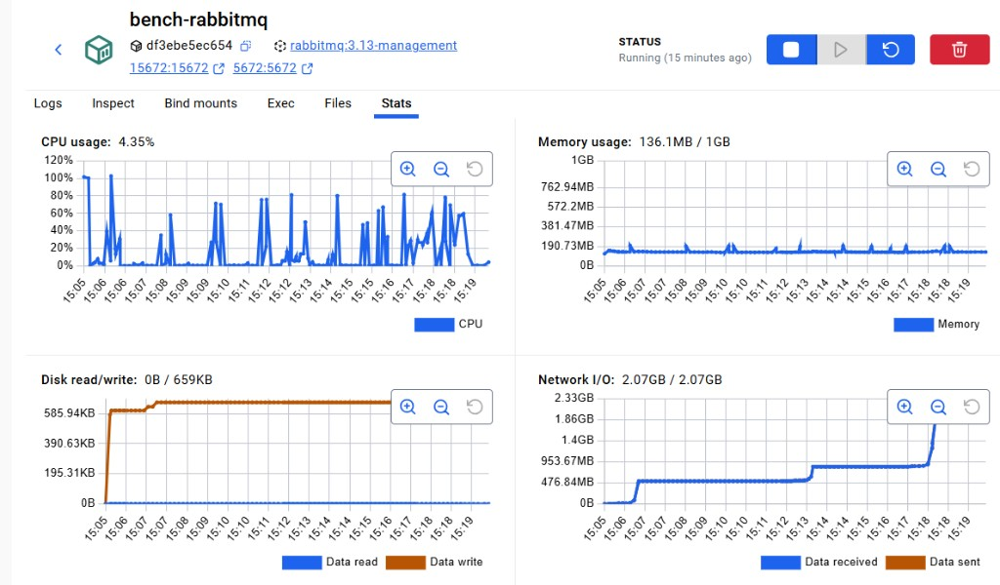
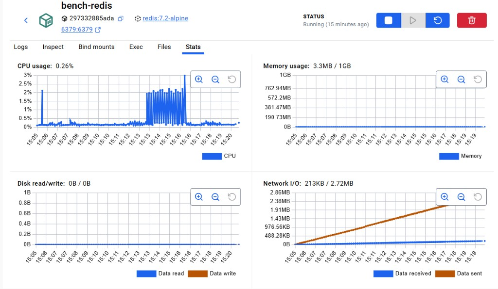

# Отчёт: сравнение RabbitMQ и Redis

**Дата отчёта:** 2026-04-21  
**Источники данных:**
- агрегированные метрики и критерии деградации — [BENCHMARK_REPORT.md](BENCHMARK_REPORT.md) (матрица от `2026-04-21T11:42:28`, breaking point, квота);
- полная матрица прогона — [matrix_20260421T121957.md](matrix_20260421T121957.md) (`2026-04-21T12:19:57`).

Условия стенда: одинаковые producer/consumer, формат сообщений (`bench/core.py`), лимиты контейнеров **1 CPU / 1 GB** на брокер ([docker-compose.yml](../docker-compose.yml)).

---

## Скриншоты Docker Desktop (Stats)

Файлы лежат в `results/screens/` (можно заменить при новых прогонах).

### RabbitMQ (`bench-rabbitmq`)



*Кратко для подписи в отчёте:* на скрине видны пики CPU до ~100% лимита одного ядра на фазах нагрузки, стабильная память ~136 MB / 1 GB, сетевой трафик порядка **~2 GB** за окно теста — согласуется с более «тяжёлым» профилем AMQP при тех же прогонах.

### Redis (`bench-redis`)



*Кратко:* низкий CPU (пики порядка единиц–трёх процентов в момент нагрузки), память **~3.3 MB / 1 GB**, сетевой обмен существенно меньше, чем у Rabbit — отражает более лёгкий путь обработки в этом сценарии.

---

## 1. Какой брокер показал большую пропускную способность

**Вывод:** при росте целевого **rate** (1k → 5k → 10k msg/s, размер 1 KiB) **Redis стабильно даёт большую эффективную скорость (eff/s)**, чем RabbitMQ. На базовом шаге **1000 msg/s** оба укладываются в цель.

### Таблица из `matrix_20260421T121957.md` — влияние интенсивности потока

| broker   |   rate |   size(B) |   sent |   recv |   lost |   errors |   eff/s |   avg ms |   p95 ms |   max ms |
|----------|--------|-----------|--------|--------|--------|----------|---------|----------|----------|----------|
| rabbitmq |   1000 |      1024 |   9996 |   9996 |      0 |        0 |   979.7 |     4.88 |    17.89 |    52.31 |
| rabbitmq |   5000 |      1024 |  23788 |  23788 |      0 |        0 |  2327.8 |    65.99 |   113.04 |   150.25 |
| rabbitmq |  10000 |      1024 |  23462 |  23462 |      0 |        0 |  2299.5 |    69.23 |   188.83 |   251.29 |
| redis    |   1000 |      1024 |   9993 |   9993 |      0 |        0 |   999.3 |     0.31 |     1.05 |     7.02 |
| redis    |   5000 |      1024 |  38642 |  38642 |      0 |        0 |  3864.2 |     0.4  |     1.07 |    14.42 |
| redis    |  10000 |      1024 |  40470 |  40470 |      0 |        0 |  3966.5 |     0.38 |     1.07 |    11.13 |

### Сводка из `BENCHMARK_REPORT.md` — rate ramp (с пометкой критериев)

| broker | rate | size(B) | eff/s | p95 ms | lost | критерии |
|---|---:|---:|---:|---:|---:|---|
| rabbitmq | 1000 | 1024 | 998.5 | 21.19 | 0 | ok: ok |
| rabbitmq | 5000 | 1024 | 2513.2 | 134.97 | 0 | ⚠ eff/s < 85% от 5000 |
| rabbitmq | 10000 | 1024 | 2491.9 | 156.08 | 0 | ⚠ eff/s < 85% от 10000 |
| redis | 1000 | 1024 | 998.5 | 1.06 | 0 | ok: ok |
| redis | 5000 | 1024 | 3970.0 | 1.19 | 0 | ⚠ eff/s < 85% от 5000 |
| redis | 10000 | 1024 | 4248.8 | 5.43 | 0 | ⚠ eff/s < 85% от 10000 |

**Квота 50k сообщений @ 2000 msg/s** ([BENCHMARK_REPORT.md](BENCHMARK_REPORT.md)): Rabbit **1983.8** eff/s, Redis **2000.0** eff/s — по throughput близко; по **p95** Rabbit **65 ms** vs Redis **1 ms**.

---

## 2. Какой брокер лучше переносит увеличение размера сообщения

**Вывод:** **Redis** сильнее держит **eff/s** и **p95** при росте размера до **100 KiB**. У **RabbitMQ** в одном из прогонов ([BENCHMARK_REPORT.md](BENCHMARK_REPORT.md)) на **102400 B** уже **деградация по throughput** (737 eff/s < 85% от 1000); в матрице **12:19** Rabbit на 100 KiB ещё около **971 eff/s** (выше порога 85%), но **p95** всё равно на порядок выше, чем у Redis.

### Таблица из `matrix_20260421T121957.md` — влияние размера сообщения

| broker   |   rate |   size(B) |   sent |   recv |   lost |   errors |   eff/s |   avg ms |   p95 ms |   max ms |
|----------|--------|-----------|--------|--------|--------|----------|---------|----------|----------|----------|
| rabbitmq |   1000 |       128 |   9986 |   9986 |      0 |        0 |   978.7 |     8.13 |    35.44 |    78.97 |
| rabbitmq |   1000 |      1024 |   9991 |   9991 |      0 |        0 |   979.2 |     5.72 |    20.23 |    54.11 |
| rabbitmq |   1000 |     10240 |   9999 |   9999 |      0 |        0 |   979.9 |     6.71 |    28.98 |    68.39 |
| rabbitmq |   1000 |    102400 |   9924 |   9924 |      0 |        0 |   971.1 |    25.06 |    42.59 |   112.43 |
| redis    |   1000 |       128 |  10000 |  10000 |      0 |        0 |   998.4 |     0.25 |     1.02 |     8.26 |
| redis    |   1000 |      1024 |   9984 |   9984 |      0 |        0 |   998.4 |     0.24 |     1.01 |     9.24 |
| redis    |   1000 |     10240 |  10000 |  10000 |      0 |        0 |  1000   |     0.28 |     1.01 |     5.87 |
| redis    |   1000 |    102400 |   9995 |   9995 |      0 |        0 |   979.6 |     0.75 |     2.21 |    15.54 |

### Фрагмент из `BENCHMARK_REPORT.md` (другой прогон матрицы — для сравнения на 100 KiB)

| broker | rate | size(B) | eff/s | p95 ms | lost | критерии |
|---|---:|---:|---:|---:|---:|---|
| rabbitmq | 1000 | 102400 | 736.8 | 96.22 | 0 | ⚠ throughput < 85% от 1000 |
| redis | 1000 | 102400 | 998.4 | 2.15 | 0 | ok |

---

## 3. При какой нагрузке single instance RabbitMQ и Redis начинают деградировать

Критерии в коде бенча: **eff/s < 85%** от `target_rate`, **потери > 5%** от sent, **p95 > 500 ms**.

### Breaking point ([BENCHMARK_REPORT.md](BENCHMARK_REPORT.md))

**RabbitMQ** — первая деградация на **5000 msg/s** (после шагов 1000 и 2500 без деградации по порогам):

| target | eff/s | p95 ms | lost | sent | вердикт |
|---:|---:|---:|---:|---:|---|
| 1000 | 977.2 | 17.16 | 0 | 9985 | ok |
| 2500 | 2434.6 | 91.99 | 0 | 24879 | ok |
| 5000 | 2663.0 | 141.68 | 0 | 27173 | throughput 2663/s < 85% of 5000/s |

**Redis** — первая деградация на **7500 msg/s**:

| target | eff/s | p95 ms | lost | sent | вердикт |
|---:|---:|---:|---:|---:|---|
| 1000 | 998.7 | 1.01 | 0 | 9987 | ok |
| 2500 | 2500.1 | 1.01 | 0 | 25001 | ok |
| 5000 | 4489.4 | 1.51 | 0 | 44894 | ok |
| 7500 | 4352.8 | 1.05 | 0 | 43528 | throughput 4353/s < 85% of 7500/s |

**Матрица rate ramp** (оба брокера на шагах **5k** и **10k** не дотягивают до 85% от целевого rate — см. таблицы в §1).

**Размер сообщения:** у Rabbit в отчёте BENCHMARK на **100 KiB** при **1k msg/s** — деградация по eff; у Redis в том же отчёте — без деградации по порогам.

---

## 4. Какой инструмент лучше подходит для такого сценария и почему

**Сценарий бенча:** одна очередь/stream, симметричные producer/consumer, измерение **throughput**, **latency (p95)** и **устойчивости** к rate и размеру сообщения на одном инстансе с лимитом CPU/RAM.

**Рекомендация по цифрам:** для этого лабораторного сценария предпочтительнее **Redis (Streams)** — выше **eff/s** на high-rate шагах, **на порядок ниже p95**, спокойнее ведёт себя на **больших сообщениях**; **single instance** Redis в breaking point «ломается» по критерию eff позже по шкале target rate (7500 vs 5000 в приведённом прогоне).

**RabbitMQ** уместен, когда важнее **AMQP**, маршрутизация, типичная продакшен-модель очередей и экосистема, а не максимальный eff в минимальной конфигурации бенча; в этом стенде он сильнее нагружает CPU (что видно на скрине Docker Stats) и даёт большую задержку при тех же шагах нагрузки.

---

## Приложение: базовое сравнение из `matrix_20260421T121957.md`

| broker   |   rate |   size(B) |   sent |   recv |   lost |   errors |   eff/s |   avg ms |   p95 ms |   max ms |
|----------|--------|-----------|--------|--------|--------|----------|---------|----------|----------|----------|
| rabbitmq |   1000 |      1024 |   9978 |   9978 |      0 |        0 |   977.9 |     6.22 |    25.33 |    61.85 |
| redis    |   1000 |      1024 |   9998 |   9998 |      0 |        0 |   999.8 |     0.3  |     1.05 |     6.82 |

## Параметры нагрузки (tz_load)

Идентичны в обоих источниках: duration **10 s** (пол), drain **5 s**, размеры **128 / 1024 / 10240 / 102400** B, rates **1000 / 5000 / 10000** msg/s.

```json
{
  "mode": "duration",
  "duration_floor_sec": 10.0,
  "target_messages": null,
  "drain_seconds": 5.0,
  "sizes_bytes": [128, 1024, 10240, 102400],
  "rates_msg_per_sec": [1000, 5000, 10000]
}
```
