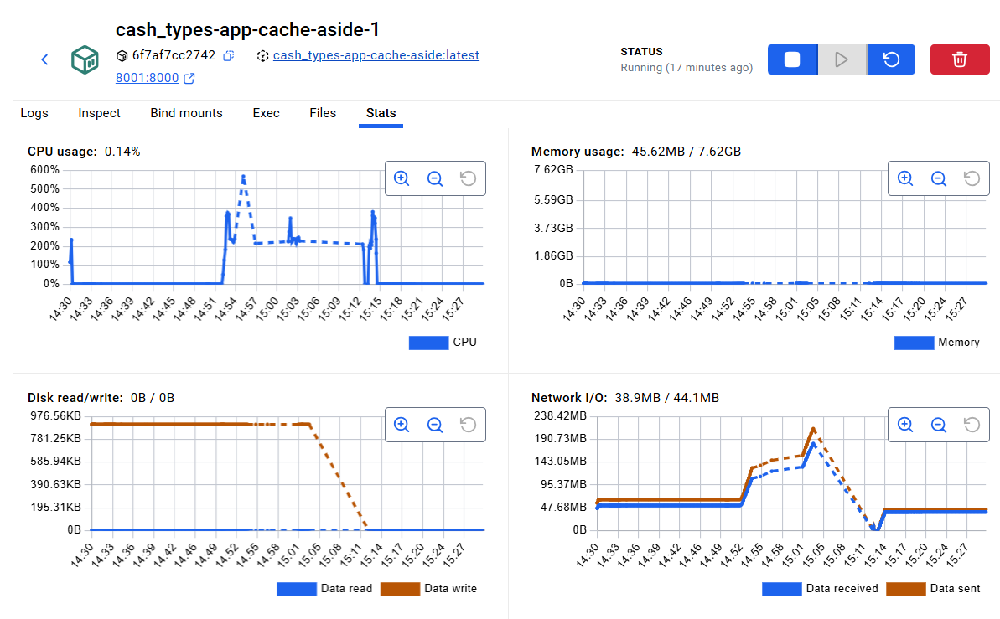
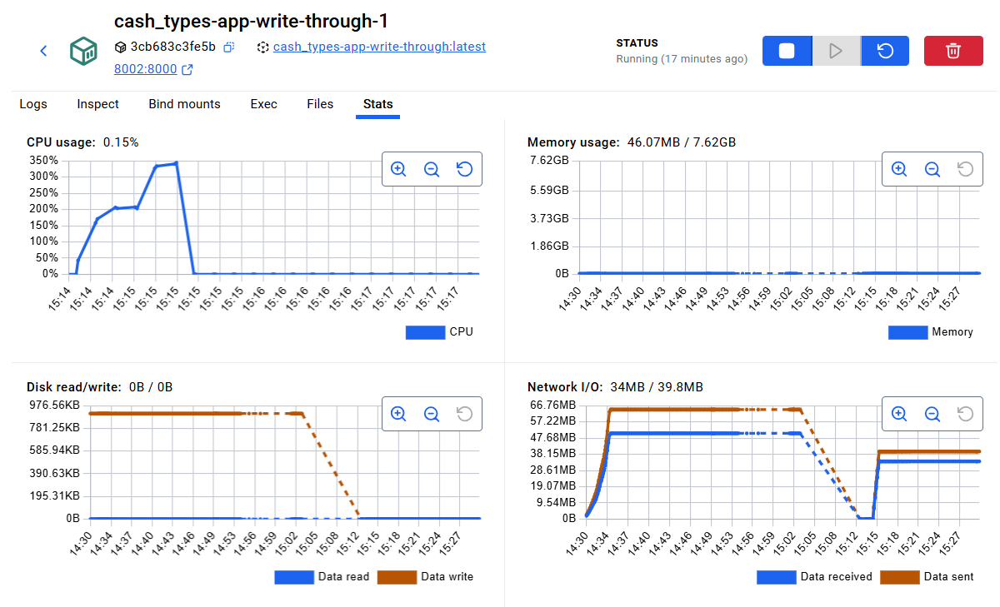
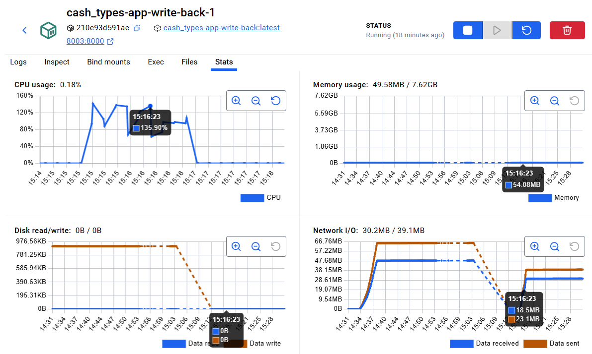
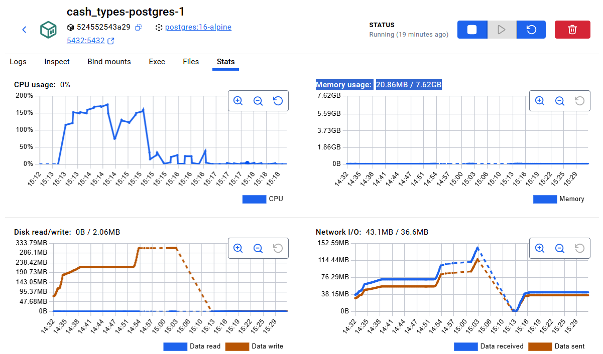
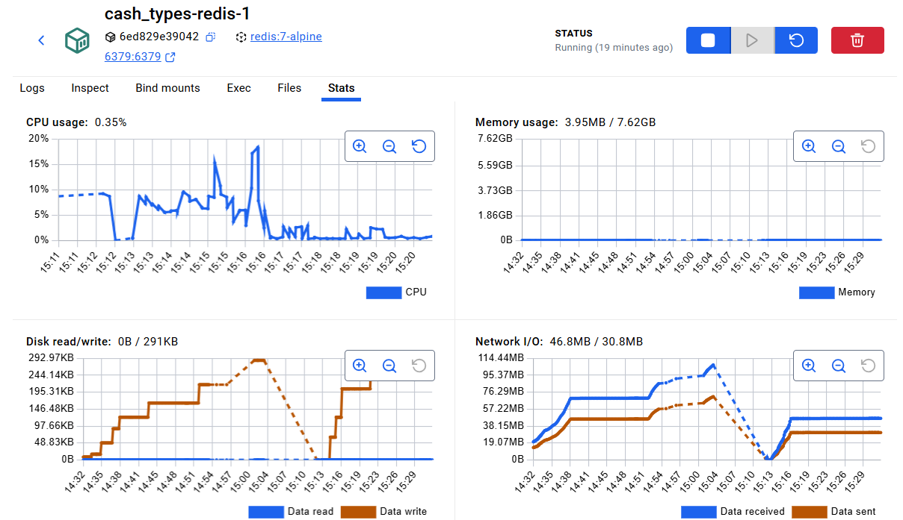

# Отчет: сравнение типов кеширования

## Описание тестов

Сравнивались три стратегии кеширования:

- `cache_aside` / Lazy Loading / Write-Around;
- `write_through`;
- `write_back`.

Для всех вариантов использовалась одна и та же система: FastAPI-приложение, Redis, PostgreSQL и единый `load_generator.py`. Перед каждым прогоном БД и кеш сбрасывались, чтобы условия были одинаковыми.

Параметры теста:

| Параметр | Значение |
|---|---:|
| Нагрузка | `rps-550` |
| Целевой RPS | до 550 req/sec |
| Запросов на сценарий | 6600 |
| Длительность | 12 секунд |
| Concurrency | 72 |
| Dataset | 1000 записей |
| Hot set | 50 записей |
| Hot key ratio | 0.95 |

Сценарии из ТЗ:

| Сценарий | Чтение | Запись |
|---|---:|---:|
| `read-heavy` | 80% | 20% |
| `balanced` | 50% | 50% |
| `write-heavy` | 20% | 80% |

Измерялись `throughput`, средняя задержка, обращения в БД, hit rate кеша. Для `write_back` дополнительно фиксировалось накопление pending-записей.

## Таблица результатов

| Стратегия | Сценарий | req/sec | avg_ms | p95_ms | db_accesses | cache_hit_rate | wb_pending_max | errors |
|---|---|---:|---:|---:|---:|---:|---:|---:|
| `cache_aside` | `read-heavy` | 357.20 | 199.57 | 266.14 | 2739 | 0.7335 | 0 | 0 |
| `cache_aside` | `balanced` | 260.88 | 273.84 | 332.88 | 5090 | 0.4513 | 0 | 0 |
| `cache_aside` | `write-heavy` | 229.07 | 312.32 | 372.33 | 6340 | 0.1962 | 0 | 0 |
| `write_through` | `read-heavy` | 472.09 | 150.92 | 188.05 | 1610 | 0.9479 | 0 | 0 |
| `write_through` | `balanced` | 332.70 | 214.58 | 275.81 | 3410 | 0.9534 | 0 | 0 |
| `write_through` | `write-heavy` | 250.79 | 284.78 | 345.52 | 5336 | 0.9540 | 0 | 0 |
| `write_back` | `read-heavy` | 460.41 | 154.77 | 429.89 | 529 | 0.9483 | 72 | 0 |
| `write_back` | `balanced` | 163.44 | 435.66 | 1726.40 | 776 | 0.9534 | 93 | 0 |
| `write_back` | `write-heavy` | 207.32 | 343.21 | 1475.44 | 668 | 0.9517 | 104 | 0 |

## Выводы

### Для чтения

Лучший вариант — `write_through`.

На `read-heavy` он показал лучший результат по скорости и задержке:

- `472.09 req/sec`;
- `150.92 ms` средней задержки;
- `188.05 ms` p95;
- `cache_hit_rate = 0.9479`.

`write_back` был близок по throughput, но p95 у него хуже: `429.89 ms`.

### Для записи

Лучший вариант — `write_back`.

На `write-heavy` он сделал намного меньше обращений к БД:

- `write_back`: `668`;
- `write_through`: `5336`;
- `cache_aside`: `6340`.

Это главный плюс Write-Back: запись сначала идет в кеш, а в БД сбрасывается позже. Минус — накопление pending-записей

### Для смешанной нагрузки

Лучший вариант — `write_through`.

На `balanced` он показал лучший баланс:

- `332.70 req/sec`;
- `214.58 ms` средней задержки;
- `275.81 ms` p95;
- `cache_hit_rate = 0.9534`.

`write_back` меньше обращался к БД, но сильно проиграл по задержке: `435.66 ms` avg и `1726.40 ms` p95.

## таблица

console-log.txt

### Скрины: docker stats

- `cash_types-app-cache-aside-1`;

- `cash_types-app-write-through-1`;

- `cash_types-app-write-back-1`;

- `cash_types-postgres-1`;

- `cash_types-redis-1`.

## Итог

| Случай | Лучший тип кеширования |
|---|---|
| Для чтения | `write_through` |
| Для записи | `write_back` |
| Для смешанной нагрузки | `write_through` |

По результатам тестов самым универсальным вариантом оказался `write_through`: он лучший для чтения и смешанной нагрузки. Для write-heavy нагрузки лучше подходит `write_back`, потому что он сильнее всего снижает количество обращений к БД. `cache_aside` оказался худшим на горячих ключах: после записи он удаляет ключ из кеша, поэтому следующие чтения часто снова идут в БД.
